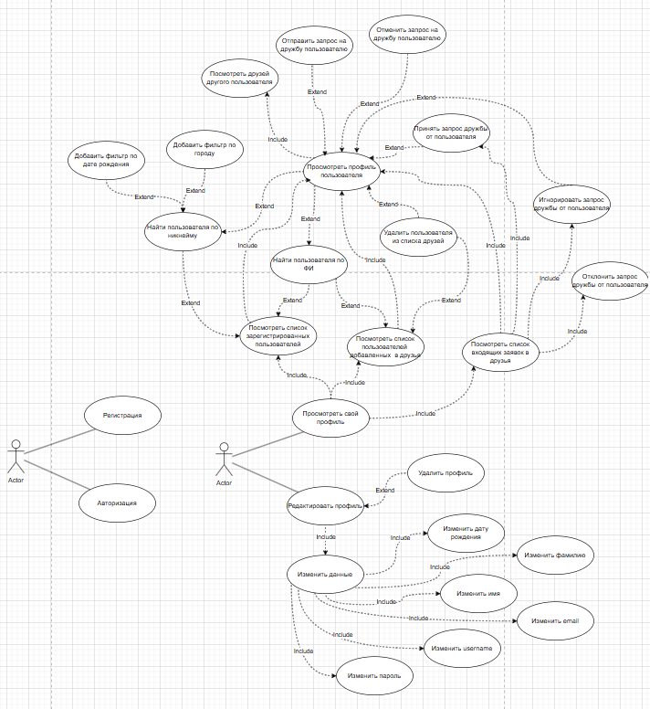

== Use Case

Графический UseCase:

Рисунок 1. Диаграмма Use Case для версии 1.0 мессенджера "Придумать название"

|===
|*Уникальный код и название* |*ВИ-1:Просмотреть свой профиль*
|Контекст использования |Просмотр своего персонального профиля
|Область действия |мессенджер "Придумать название"
|Основное действующее лицо |Пользователь
|Предусловие |Пользователь должен быть авторизован
|Минимальные гарантии успеха |Профиль не отображается
|Гарантии успеха |Пользователь видит свой профиль
|Триггер |Любой момент при использовании мессенджера "Придумать название"
|Базовый сценарий |Просмотреть свой профиль
|1 |Пользователь авторизовался в мессенджере "Придумать название"
|2 |Пользователь оказывается на своем профиле
|===
|===
|*Уникальный код и название* |*ВИ-2:Посмотреть список входящих заявок в друзья*
|Контекст использования |Посмотреть список входящих заявок в друзья
|Область действия |мессенджер "Придумать название"
|Основное действующее лицо |Пользователь
|Предусловие |Пользователь должен быть авторизован
|Минимальные гарантии успеха |Функция просмотра списка входящих заявок недоступна
|Гарантии успеха |Пользователь видит список входящих заявок в друзья
|Триггер |Любой момент при использовании мессенджера "Придумать название"
|Базовый сценарий |Посмотреть список входящих заявок в друзья
|1 |Пользователь находится на главной странице своего профиля
|2 |Пользователь переходит на страницу входящих заявок в друзья
|3 |Пользователь просматривает список входящих заявок
|Расширения |Страница недоступна
|2a |Пользователь находится на главной странице своего профиля
|2a1 |Пользователь переходит на страницу входящих заявок в друзья
|2a2 |Система отображает ошибку
|===
|===
|*Уникальный код и название* |*ВИ-3:Отклонить запрос дружбы от пользователя*
|Контекст использования |Отклонить запрос дружбы от пользователя
|Область действия |мессенджер "Придумать название"
|Основное действующее лицо |Пользователь
|Предусловие |Пользователь должен быть авторизован, у пользователя должна быть минимум одна активная заявка в друзья
|Минимальные гарантии успеха |Функция отклонить запрос дружбы недоступна
|Гарантии успеха |Пользователь успешно отклонил запрос дружбы
|Триггер |Пользователю пришел запрос на дружбу
|Базовый сценарий |Отклонить запрос дружбы от пользователя
|1 |Пользователь переходит на страницу входящих заявок в друзья
|2 |Пользователь отклоняет входящий запрос дружбы
|3 |Запрос пропадает из списка входящих запросов
|Расширения |Запрос остается в списке
|2a |Пользователь отклоняет входящий запрос дружбы
|2a1 |Запрос остается в списке входящих запросов
|===
|===
|*Уникальный код и название* |*ВИ-4:Принять запрос дружбы от пользователя*
|Контекст использования |Принять запрос дружбы от пользователя
|Область действия |мессенджер "Придумать название"
|Основное действующее лицо |Пользователь
|Предусловие |Пользователь должен быть авторизован, у пользователя должна быть минимум одна активная заявка в друзья
|Минимальные гарантии успеха |Функция принять запрос дружбы недоступна
|Гарантии успеха |Пользователь принял запрос дружбы, Добавленный пользователь отображается в списке друзей
|Триггер |Пользователю пришел запрос на дружбу
|Базовый сценарий |Принять запрос дружбы от пользователя
|1 |Пользователь переходит на страницу входящих заявок в друзья
|2 |Пользователь принимает входящий запрос дружбы
|3 |Запрос пропадает из списка входящих запросов
|4 |Добавленный пользователь отображается в списке друзей
|Расширения |Запрос остается в списке
|2a |Пользователь отклоняет входящий запрос дружбы
|2a1 |Запрос остается в списке входящих запросов
|Расширения |Добавленный пользователь не отображается в списке друзей
|2б |Пользователь принимает входящий запрос дружбы
|2б1 |Добавленный пользователь не отображается в списке друзей
|===
|===
|*Уникальный код и название* |*ВИ-5:Посмотреть список пользователей добавленных в друзья*
|Контекст использования |Посмотреть список пользователей добавленных в друзья
|Область действия |мессенджер "Придумать название"
|Основное действующее лицо |Пользователь
|Предусловие |Пользователь должен быть авторизован
|Минимальные гарантии успеха |Страница со списком друзей недоступна
|Гарантии успеха |Пользователь видит список пользователей добавленных в друзья
|Триггер |Пользователь хочет посмотреть список своих друзей
|Базовый сценарий |Посмотреть список пользователей добавленных в друзья
|1 |Пользователь находится на главной странице своего профиля
|2 |Пользователь переходит на страницу со списком своих друзей
|3 |Пользователь просматривает список своих друзей
|Расширения |Страница недоступна
|2a |Пользователь находится на главной странице своего профиля
|2a1 |Пользователь переходит на страницу со списком своих друзей
|2a2 |Система отображает ошибку
|===
|===
|*Уникальный код и название* |*ВИ-6:Удалить пользователя из списка друзей*
|Контекст использования |Удалить пользователя из списка друзей
|Область действия |мессенджер "Придумать название"
|Основное действующее лицо |Пользователь
|Предусловие |Пользователь должен быть авторизован, у пользователя должен быть минимум один друг
|Минимальные гарантии успеха |Страница со списком друзей недоступна
|Гарантии успеха |Пользователь больше не отображается в списке друзей
|Триггер |Пользователь хочет удалить другого пользователя из списка своих друзей
|Базовый сценарий |Удалить пользователя из списка друзей
|1 |Пользователь переходит на страницу со списком своих друзей
|2 |Пользователь выбирает пользователя, которого хочет удалить из друзей
|3 |Пользователь удаляет выбранного пользователя
|4 |Удаленный пользователь пропадает из списка друзей
|Расширения |Удаленный пользователь остается в списке друзей
|3a |Пользователь удаляет выбранного пользователя
|3a1 |Удаленный пользователь отображается в списке друзей
|===
|===
|*Уникальный код и название* |*ВИ-7:Просмотреть профиль пользователя*
|Контекст использования |Просмотреть профиль пользователя
|Область действия |мессенджер "Придумать название"
|Основное действующее лицо |Пользователь
|Предусловие |Пользователь должен быть авторизован
|Минимальные гарантии успеха |Профиль пользователя недоступен
|Гарантии успеха |Пользователь просматривает профиль другого пользователя
|Триггер |Пользователь хочет посмотреть профиль другого пользователя
|Базовый сценарий |Просмотреть профиль пользователя
|1 |Пользователь выбирает другого пользователя, чей профиль хочет просмотреть
|2 |Пользователь переходит на профиль другого пользователя
|3 |Пользователь просматривает профиль другого пользователя
|Расширения |Профиль недоступен
|2a |Пользователь переходит на профиль другого пользователя
|2a1 |Система отображает ошибку
|===
|===
|*Уникальный код и название* |*ВИ-8:Посмотреть список зарегистрированных пользователей*
|Контекст использования |Посмотреть список зарегистрированных пользователей
|Область действия |мессенджер "Придумать название"
|Основное действующее лицо |Пользователь
|Предусловие |Пользователь должен быть авторизован
|Минимальные гарантии успеха |Страница со списком пользователей недоступна
|Гарантии успеха |Пользователь видит список зарегистрированных пользователей
|Триггер |Пользователь хочет посмотреть список зарегистрированных пользователей
|Базовый сценарий |Посмотреть список зарегистрированных пользователей
|1 |Пользователь находится на главной странице своего профиля
|2 |Пользователь переходит на страницу со списком зарегистрированных пользователей
|3 |Пользователь просматривает список зарегистрированных пользователей
|Расширения |Страница недоступна
|2a |Пользователь находится на главной странице своего профиля
|2a1 |Пользователь переходит на страницу со списком зарегистрированных пользователей
|2a2 |Система отображает ошибку
|===
|===
|*Уникальный код и название* |*ВИ-9:Найти пользователя по ФИ*
|Контекст использования |Найти пользователя по ФИ
|Область действия |мессенджер "Придумать название"
|Основное действующее лицо |Пользователь
|Предусловие |Пользователь должен быть авторизован, пользователь с указанными ФИ должен быть зарегистрирован
|Минимальные гарантии успеха |Поиск по ФИ неактивен
|Гарантии успеха |Пользователь нашел другого пользователя по ФИ
|Триггер |Пользователь хочет найти другого пользователя по ФИ
|Базовый сценарий |Найти пользователя по ФИ
|1 |Пользователь находится на странице со списком пользователей
|2 |Пользователь указывает ФИ нужного ему пользователя
|3 |Система отображает список пользователей соответствующих запросу
|Расширения |Условия поиска не выполняются
|2a |Пользователь указывает ФИ нужного ему пользователя
|2a1 |Система отображает пустой список пользователей
|Расширения |Опечатка в воде данных
|2б |Пользователь указывает ФИ нужного ему пользователя с ошибкой
|2б1 |Система отображает пустой список пользователей
|===
|===
|*Уникальный код и название* |*ВИ-10:Найти пользователя по никнейму*
|Контекст использования |Найти пользователя по никнейм
|Область действия |мессенджер "Придумать название"
|Основное действующее лицо |Пользователь
|Предусловие |Пользователь должен быть авторизован, пользователь с указанным никнеймом должен быть зарегистрирован
|Минимальные гарантии успеха |Поиск по никнейму неактивен
|Гарантии успеха |Пользователь нашел другого пользователя по никнейму
|Триггер |Пользователь хочет найти другого пользователя по никнейму
|Базовый сценарий |Найти пользователя по никнейму
|1 |Пользователь находится на странице со списком пользователей
|2 |Пользователь указывает никнейм нужного ему пользователя
|3 |Система отображает список пользователей соответствующих запросу
|Расширения |Условия поиска не выполняются
|2a |Пользователь указывает никнейм нужного ему пользователя
|2a1 |Система отображает пустой список пользователей
|Расширения |Опечатка в воде данных
|2б |Пользователь указывает никнейм нужного ему пользователя с ошибкой
|2б1 |Система отображает пустой список пользователей
|===
|===
|*Уникальный код и название* |*ВИ-11:Добавить фильтр по дате рождения*
|Контекст использования |Добавить фильтр по дате рождения
|Область действия |мессенджер "Придумать название"
|Основное действующее лицо |Пользователь
|Предусловие |Пользователь должен быть авторизован
|Минимальные гарантии успеха |Фильтр по дате рождения неактивен
|Гарантии успеха |Список пользователей фильтруется по дате рождения
|Триггер |Пользователь хочет отфильтровать список пользователей
|Базовый сценарий |Добавить фильтр по дате рождения
|1 |Пользователь находится на странице со списком пользователей
|2 |Пользователь фильтрует пользователей по дате рождения
|3 |Система отображает отфильтрованный список пользователей
|Расширения |Фильтрация не работает
|2a |Пользователь фильтрует пользователей по дате рождения
|2a1 |Система отображает список пользователей без учета фильта
|===
|===
|*Уникальный код и название* |*ВИ-12:Добавить фильтр по городу*
|Контекст использования |Добавить фильтр по городу
|Область действия |мессенджер "Придумать название"
|Основное действующее лицо |Пользователь
|Предусловие |Пользователь должен быть авторизован
|Минимальные гарантии успеха |Фильтр по городу неактивен
|Гарантии успеха |Список пользователей фильтруется по городу
|Триггер |Пользователь хочет отфильтровать список пользователей
|Базовый сценарий |Добавить фильтр по городу
|1 |Пользователь находится на странице со списком пользователей
|2 |Пользователь фильтрует пользователей по городу
|3 |Система отображает отфильтрованный список пользователей
|Расширения |Фильтрация не работает
|2a |Пользователь фильтрует пользователей по городу
|2a1 |Система отображает список пользователей без учета фильта
|===
|===
|*Уникальный код и название* |*ВИ-13:Посмотреть друзей другого пользователя*
|Контекст использования |Посмотреть друзей другого пользователя
|Область действия |мессенджер "Придумать название"
|Основное действующее лицо |Пользователь
|Предусловие |Пользователь должен быть авторизован
|Минимальные гарантии успеха |Страница со списком друзей другого пользователя недоступна
|Гарантии успеха |Пользователь видит список друзей другого пользователя
|Триггер |Пользователь хочет посмотреть список друзей другого пользователя
|Базовый сценарий |Посмотреть друзей другого пользователя
|1 |Пользователь находится на главной странице своего профиля
|2 |Пользователь переходит на страницу со списком пользователей
|3 |Пользователь просматривает список пользователей
|4 |Пользователь выбирает другого пользователя
|5 |Пользователь переходит на профиль другого пользователя
|6 |Пользователь переходит на страницу со списком друзей другого пользователя
|7 |Пользователь просматривает список друзей другого пользователя
|===
|===
|*Уникальный код и название* |*ВИ-14:Отправить запрос на дружбу пользователю*
|Контекст использования |Отправить запрос на дружбу пользователю
|Область действия |мессенджер "Придумать название"
|Основное действующее лицо |Пользователь
|Предусловие |Пользователь должен быть авторизован, выбранный пользователь не должен быть в списке друзей пользователя
|Минимальные гарантии успеха |Запрос на дружбу пользователю неактивен
|Гарантии успеха |Пользователь отправил запрос на дружбу пользователю
|Триггер |Пользователь хочет отправить запрос на дружбу другому пользователю
|Базовый сценарий |Отправить запрос на дружбу пользователю
|1 |Пользователь переходит на профиль другого пользователя
|2 |Пользователь совершает действие для добавления другого пользователя в друзья
|3 |Система оповещает другого пользователя о новой заявке в друзья
|===
|===
|*Уникальный код и название* |*ВИ-15:Отменить запрос на дружбу пользователю*
|Контекст использования |Отменить запрос на дружбу пользователю
|Область действия |мессенджер "Придумать название"
|Основное действующее лицо |Пользователь
|Предусловие |Пользователь должен быть авторизован, выбранному пользователелю ранее был отправлен запрос дружбы
|Минимальные гарантии успеха |Функция отмены запроса на дружбу пользователю неактивна
|Гарантии успеха |Пользователь отменил запрос на дружбу пользователю
|Триггер |Пользователь хочет отменить запрос на дружбу другому пользователю
|Базовый сценарий |Отменить запрос на дружбу пользователю
|1 |Пользователь переходит на профиль другого пользователя
|2 |Пользователь совершает действие для отмены добавления другого пользователя в друзья
|===
|===
|*Уникальный код и название* |*ВИ-16:Игнорировать запрос дружбы от пользователя*
|Контекст использования |Игнорировать запрос дружбы от пользователя
|Область действия |мессенджер "Придумать название"
|Основное действующее лицо |Пользователь
|Предусловие |Пользователь должен быть авторизован, у пользователя должна быть минимум одна активная заявка в друзья
|Минимальные гарантии успеха |Запрос дружбы неотображается
|Гарантии успеха |Пользователь видит и игнорирует запрос дружбы
|Триггер |Пользователю пришел запрос на дружбу
|Базовый сценарий |Игнорировать запрос дружбы от пользователя
|1 |Пользователь переходит на страницу входящих заявок в друзья
|2 |Пользователь видит входящий запрос дружбы
|===
|===
|*Уникальный код и название* |*ВИ-17:Регистрация*
|Контекст использования |Зарегистрироваться в системе
|Область действия |мессенджер "Придумать название"
|Основное действующее лицо |Новый пользователь
|Предусловие |Пользователь зашел на сайт мессенджера
|Минимальные гарантии успеха |Функция регистрации недоступна
|Гарантии успеха |Пользователь зарегистрирован в системе
|Триггер |Пользователь хочет зарегистрировать новый аккаунт
|Базовый сценарий |Регистрация
|1 |Пользователь переходит на страницу регистрации
|2 |Пользователь вводит Email
|3 |Пользователь придумывает пароль
|4 |Пользователь вводит пароль повторно
|5 |Пользователь подтверждает данные
|6 |Система отправляет запрос с подтверждением на Email
|7 |Пользователь подтверждает регистрацию нового аккаунта
|8 |Система регистрирует новый аккаунт
|9 |Пользователь вводит имя
|10 |Пользователь вводит фамилию
|11 |Пользователь вводит дату рождения
|12 |Пользователь подтверждает данные
|13 |Система создает профиль нового пользователя
|14 |Система отправляет уведомление о регистрации нового аккаунта на Email
|Расширения |Email уже зарегистрирован
|2a |Пользователь вводит Email, который уже существует в системе
|2a1 |Система отображает ошибку с просьбой ввести другой Email
|Расширения |Пароли не совпадают
|4a |Пользователь ошибается при повторном вводе пароля
|4a1 |Система отображает ошибку с уведомлением о несовпадении паролей
|Расширения |Неверный формат данных
|9a |Пользователь вводит имя используя некорректные символы
|9a1 |Система отображает ошибку с уведомлением о некорректном имени
|===
|===
|*Уникальный код и название* |*ВИ-18:Авторизация*
|Контекст использования |Авторизоваться в системе
|Область действия |мессенджер "Придумать название"
|Основное действующее лицо |Пользователь
|Предусловие |Пользователь должен быть зарегистрирован
|Минимальные гарантии успеха |Функция авторизации недоступна
|Гарантии успеха |Пользователь авторизовался в системе
|Триггер |Пользователь хочет авторизоваться в системе
|Базовый сценарий |Авторизация
|1 |Пользователь переходит на страницу авторизации
|2 |Пользователь вводит username
|3 |Пользователь вводит пароль
|4 |Пользователь входит в систему
|5 |Система обрабатывает запрос
|6 |Система авторизует пользователя
|7 |Система создает профиль нового пользователя
|Расширения |Пользователь вводит не корректный username
|2a |Пользователь вводит username, который не существует в системе
|2a1 |Система отображает ошибку с просьбой указать корректный username
|Расширения |Пользователь вводит некорректный пароль
|3a |Пользователь вводит некорректный пароль
|3a1 |Система отображает ошибку с просьбой указать корректный пароль
|Расширения |Пользователь ввел некорректный пароль больше трех раз
|3a |Пользователь ввел некорректный пароль три раза
|3a1 |Система блокирует возможность авторизации и отображает ошибку с уведомлением о временной блокировке входа в аккаунт
|3a2 |Система отправляет уведомление на Email о подозрительной активности
|===
|===
|*Уникальный код и название* |*ВИ-19:Изменить дату рождения*
|Контекст использования |Изменить дату рождения
|Область действия |мессенджер "Придумать название"
|Основное действующее лицо |Пользователь
|Предусловие |Пользователь должен быть зарегистрирован
|Минимальные гарантии успеха |Функция изменить дату рождения недоступна
|Гарантии успеха |Пользователь изменил дату рождения
|Триггер |Пользователь хочет поменять свою дату рождения
|Базовый сценарий |Изменить дату рождения
|1 |Пользователь переходит на страницу редактирования профиля
|2 |Пользователь вводит новую дату рождения
|3 |Пользователь подтверждает действие
|4 |Система обновляет профиль пользователя
|===
|===
|*Уникальный код и название* |*ВИ-20:Изменить имя
|Контекст использования |Изменить имя
|Область действия |мессенджер "Придумать название"
|Основное действующее лицо |Пользователь
|Предусловие |Пользователь должен быть зарегистрирован
|Минимальные гарантии успеха |Функция изменить имя недоступна
|Гарантии успеха |Имя пользователя изменено
|Триггер |Пользователь хочет поменять свое имя
|Базовый сценарий |Изменить имя
|1 |Пользователь переходит на страницу редактирования профиля
|2 |Пользователь вводит новое имя
|3 |Пользователь подтверждает действие
|4 |Система обновляет профиль пользователя
|Расширения |Формат имени некорректный
|2a |Пользователь ввел некорректное имя
|2a1 |Система отображает ошибку с уведомлением о некорректно указанном имени
|===
|===
|*Уникальный код и название* |*ВИ-21:Изменить фамилию
|Контекст использования |Изменить фамилию
|Область действия |мессенджер "Придумать название"
|Основное действующее лицо |Пользователь
|Предусловие |Пользователь должен быть зарегистрирован
|Минимальные гарантии успеха |Функция изменить фамилию недоступна
|Гарантии успеха |Фамилия пользователя изменена
|Триггер |Пользователь хочет поменять свою фамилию
|Базовый сценарий |Изменить фамилию
|1 |Пользователь переходит на страницу редактирования профиля
|2 |Пользователь вводит новую фамилию
|3 |Пользователь подтверждает действие
|4 |Система обновляет профиль пользователя
|Расширения |Формат фамилии некорректный
|2a |Пользователь ввел некорректную фамилию
|2a1 |Система отображает ошибку с уведомлением о некорректно указанной фамилии
|===
|===
|*Уникальный код и название* |*ВИ-22:Изменить Email
|Контекст использования |Изменить Email
|Область действия |мессенджер "Придумать название"
|Основное действующее лицо |Пользователь
|Предусловие |Пользователь должен быть зарегистрирован
|Минимальные гарантии успеха |Функция изменить Email недоступна
|Гарантии успеха |Email пользователя изменен
|Триггер |Пользователь хочет поменять свой Email
|Базовый сценарий |Изменить Email
|1 |Пользователь переходит на страницу редактирования профиля
|2 |Пользователь вводит старый Email
|3 |Пользователь вводит новый Email
|4 |Пользователь подтверждает действие
|5 |Пользователь вводит ответ на секретный вопрос
|6 |Система отправляет запрос на подтверждение смены Email на новый Email адрес
|7 |Пользователь подтверждает запрос
|8 |Система обновляет Email
|Расширения |Новый Email уже зарегистрирован в системе
|3a |Пользователь вводит новый Email
|3a1 |Система отображает ошибку с уведомлением что данный Email уже зарегистрирован
|Расширения |Ответ на секретный вопрос неверный
|5a |Пользователь вводит неверный ответ на секретный вопрос
|5a1 |Система отображает ошибку с уведомлением что ответ на секретный вопрос неверный
|5б |Пользователь вводит неверный ответ на секретный вопрос больше трех раз
|5б1 |Система временно блокирует возможность смены Email и уведомляет пользователя об ограничении
|5б2 |Система возвращается на шаг 1
|===
|===
|*Уникальный код и название* |*ВИ-23:Изменить пароль
|Контекст использования |Изменить пароль
|Область действия |мессенджер "Придумать название"
|Основное действующее лицо |Пользователь
|Предусловие |Пользователь должен быть зарегистрирован
|Минимальные гарантии успеха |Функция изменить пароль недоступна
|Гарантии успеха |Пароль пользователя изменен
|Триггер |Пользователь хочет поменять свой пароль
|Базовый сценарий |Изменить пароль
|1 |Пользователь переходит на страницу редактирования профиля
|2 |Пользователь вводит старый пароль
|3 |Пользователь вводит новый пароль
|4 |Пользователь подтверждает действие
|5 |Пользователь вводит ответ на секретный вопрос
|6 |Система отправляет запрос на подтверждение смены пароля на Email адрес
|7 |Пользователь подтверждает запрос
|8 |Система обновляет пароль
|Расширения |Ответ на секретный вопрос неверный
|5a |Пользователь вводит неверный ответ на секретный вопрос
|5a1 |Система отображает ошибку с уведомлением что ответ на секретный вопрос неверный
|5б |Пользователь вводит неверный ответ на секретный вопрос больше трех раз
|5б1 |Система временно блокирует возможность смены пароля и уведомляет пользователя об ограничении
|5б2 |Система возвращается на шаг 1
|===
|===
|*Уникальный код и название* |*ВИ-24:Изменить username
|Контекст использования |Изменить username
|Область действия |мессенджер "Придумать название"
|Основное действующее лицо |Пользователь
|Предусловие |Пользователь должен быть зарегистрирован
|Минимальные гарантии успеха |Функция изменить username недоступна
|Гарантии успеха |Username пользователя изменен
|Триггер |Пользователь хочет поменять свой username
|Базовый сценарий |Изменить username
|1 |Пользователь переходит на страницу редактирования профиля
|2 |Пользователь вводит старый username
|3 |Пользователь вводит новый username
|4 |Пользователь подтверждает действие
|5 |Пользователь вводит ответ на секретный вопрос
|6 |Система отправляет запрос на подтверждение смены username на Email адрес
|7 |Пользователь подтверждает запрос
|8 |Система обновляет username
|Расширения |Новый username уже зарегистрирован в системе
|3a |Пользователь вводит новый username
|3a1 |Система отображает ошибку с уведомлением что данный username уже зарегистрирован
|Расширения |Ответ на секретный вопрос неверный
|5a |Пользователь вводит неверный ответ на секретный вопрос
|5a1 |Система отображает ошибку с уведомлением что ответ на секретный вопрос неверный
|5б |Пользователь вводит неверный ответ на секретный вопрос больше трех раз
|5б1 |Система временно блокирует возможность смены пароля и уведомляет пользователя об ограничении
|5б2 |Система возвращается на шаг 1
|===
